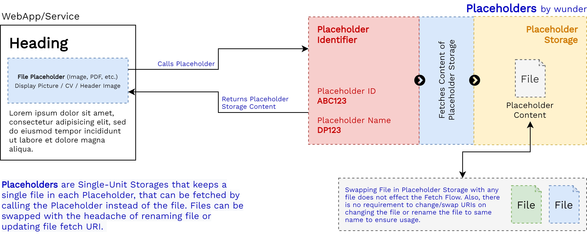
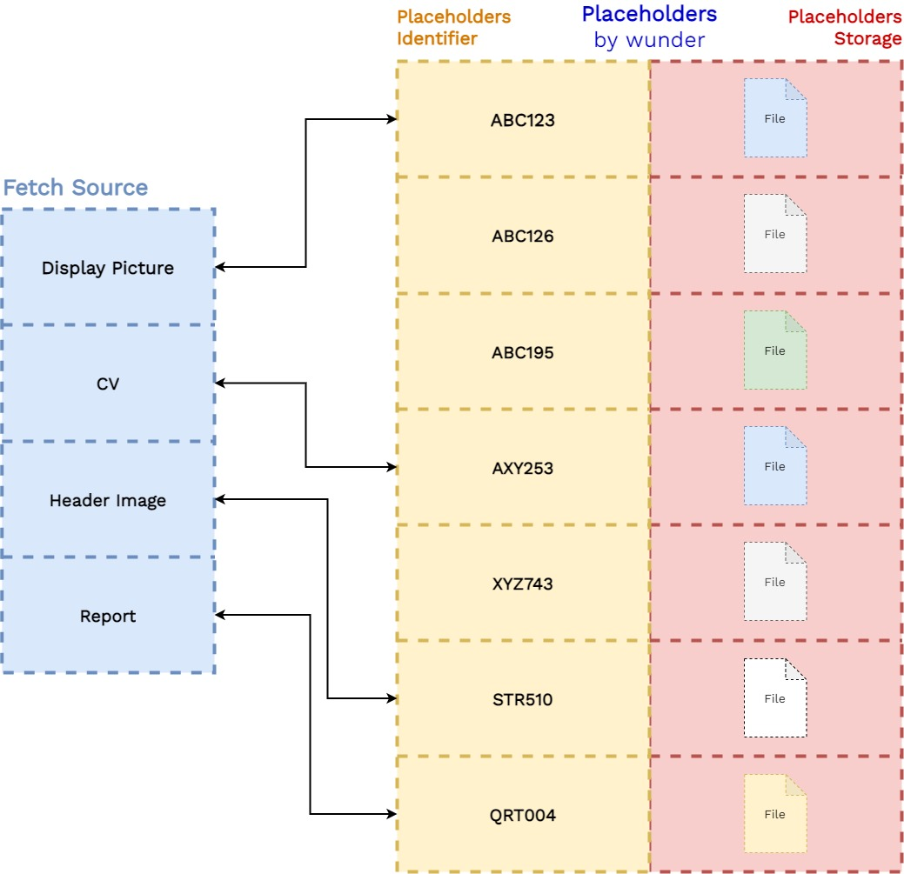

<p align="center">
  
</p>

# Placeholder 

Placeholders is a single-unit file storage solution for your Frontend.

## Why Placeholder?

Generally, when a website/service requests for files from a remote storage - it uses the URL for fetching the remote resource. For Example 
```

```
In a case when the resource is swapped (with another files of different name) it fails to fetch the resource.

To make it work/ keep it up and running, we either need to keep the name of the file same, by renaming it everytime we change the file or we need to update the fetch URL.

To overcome this, a **Placeholder** provides a single file storage location, that can be called/fetched to access the content of the placeholder storage. This removes the requirement to rename file or change the URL whenever the file is swapped.


## How it works?

A Placeholder is a single unit file storage that stores a file that can be fetched by calling the containing Placeholder. 

1. Create a Project.
2. Create a Placeholder for the Project. 
3. Upload the File to the Placeholder Storage.
4. The Placeholder Engine maps the <kbd> Placeholder Identifiers </kbd>  (ID and Name) to the file stored inside the Placeholder Storage
5. Fetch the Placeholder using any of the Identifiers.
6. When Swaping the file in Placeholder Storage with a new file, with a different name or extension, the user can upload the new file withput renaming the file.
7. The Placeholder Engine maps the Identifiers to the newly uploaded file in the Placeholder Storage.


*Figure-1: Placeholder Flowdiagram*


*Figure-2: Multiple Placeholder Structure*


## Use Cases

Some use-cases of Placeholders are,

1. A Blog Post Header Image might requires updation as per requirement. Having a File URL-based fetching can limit the functionality, as when a new image is uploaded, the file needs to be renamed to the previous image's filename or the fetch URL needs to be updated everytime. In such a case, Placeholders can be used to store the image, and the placeholder can be called/fetched instead of the file, this removes the dependance on filenames. The placeholder returns the contained image irrespective of its name.

2. An user generates her CV and names the file according to the updation date. Everytime she updates the file, she requires to create a second copy and renames it to the previous filename, so as to keep the fetch URL up and running on her website. In such a case, she can use a placeholder to store her resume without changing the filename, or updating the fetch URL on her website, and rather call the Placeholder to get the contained file.

