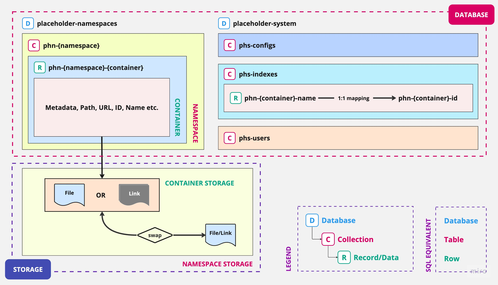

# Design

This is the design documentation for Placeholders.

## Databases Design

These are the databases design and setup required for Placeholders.

These databases (as of now) should be essential for placeholders design

- ph-namespaces `D`

	For each [namespace](#) there is ONE collection. These collections contain list of containers within that namespace.

	- phn-{namespace-id/name} `C`

		Each Namespace is a list of containers within them, and is a list of Records in the collection. Each record is an unique ph-container. Each container is one unique placeholder.

    	- phn-{namespace-id/name}-{containers-id/name} `R`

    		Containers are the basic unit in placeholder that store the content and details. Each container (placeholder) ID/Name maps to the Placeholder's unique URL. 

    		```
    		ph.com/container-id-a
    		```

    		Here `container-id-a` is the placeholder id that points to the content in the container A.


- ph-system `D`

	A database containing all SYSTEM-LEVEL data and setting.

	- phs-configs `C`

		A collection containing all USER and NAMESPACE -level configs

	- phs-indexes `C`

		A collection where each record (row) is a mapping of unique placeholder-names to placeholder-id and vice versa.

		- ph-container-name ➡️ ph-container-id   `R`
		- ph-container-id   ➡️ ph-container-name `R`

	- phs-users `C`

		A collection with data about placeholder users. Can be set by Identity Provider.





### *Legends*

| Symbol | Name        | SQL Equivalent |
|--------|-------------|----------------|
| `D`    | Database    | Database       |
| `C`    | Collection  | Table          |
| `R`    | Record/Data | Row            |